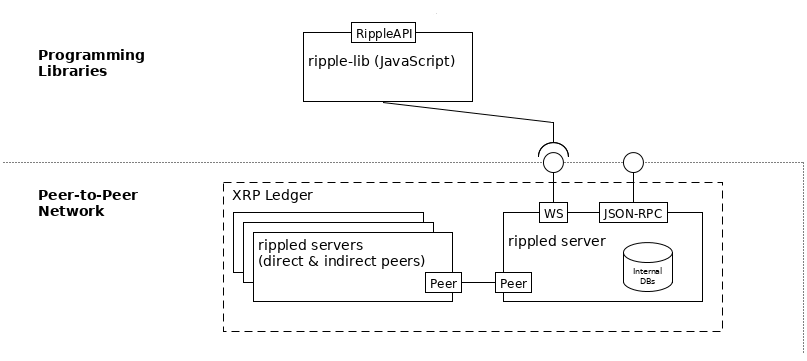
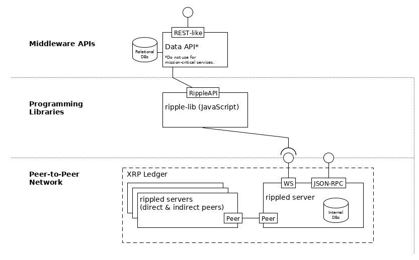
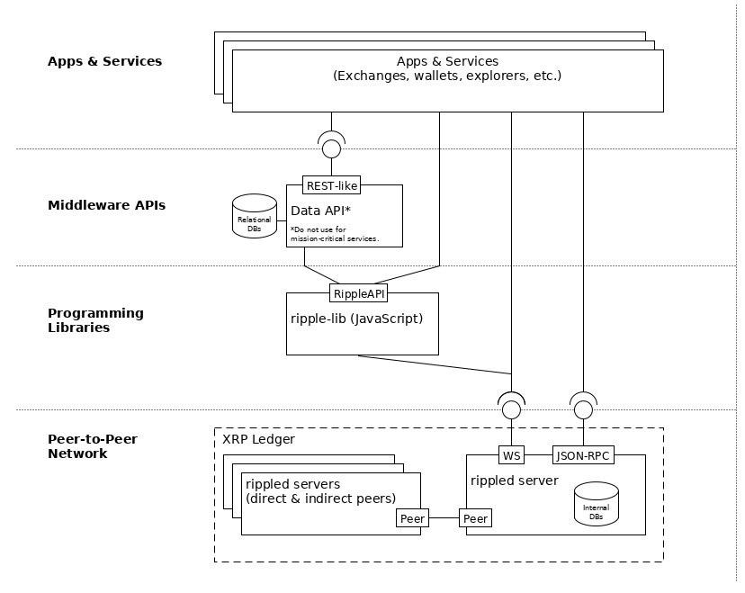

# Understanding the XRPL Ecosystem

The XRP Ledger is a layered ecosystem of software projects that power and enable the Internet of Value. It is impossible to list every project, tool, and business that interacts with the XRP Ledger. This page highlights some core projects. 

- The base of the ledger is a peer-to-peer network of always-on servers sharing transactions, engaging in the consensus process and coordinating transactions.

- Programming libraries provide methods to interact with the XRP Ledger.

- Middleware provides indirect access to XRP Ledger data. 

- Apps and Services provide user-level interaction with the XRP Ledger.

## rippled: The Core Server

The peer-to-peer network at the heart of the XRP Ledger requires a highly reliable, efficient server to enforce the rules of consensus and transaction processing. Ripple manages and publishes a reference implementation of this server software, called `rippled` (pronounced "ripple-dee"). The server is available under a permissive open-source license. Anyone can inspect and modify their own instance of the server, and re-publish with few restrictions.

Every XRPL instance of `rippled` syncs to the same network and has access to all communications across the network. Every `rippled` server on the network keeps a complete copy of the latest state data for the entire XRP Ledger. Each server stores a slice of recent transactions and a record of the changes those transactions made. Every server processes every transaction independently, while verifying that its outcome matches the rest of the network. Servers can be configured to keep more ledger history and to participate in the _consensus_ process as a _validator_.

`rippled` APIs allow users to look up data, administer the server, and submit transactions.

## Programming Libraries

Programming libraries are not strictly required to access XRP Ledger data, since you can use HTTP or WebSocket to connect to the `rippled` APIs directly. Libraries simplify some of the common work of accessing the `rippled` APIs, and convert the data into forms that are easier to understand and program in the programming language of the library.

## Middleware

Middleware services are programs that consume XRP Ledger APIs on one side and provide their own APIs on the other side. They provide a layer of abstraction to make it easier to build higher level applications by providing some common functionality as a service.

Unlike programming libraries, which start and shut down with the program that imports them, middleware services typically stay running indefinitely. Middleware services can have their own databases and configuration files.

The Data API is an example of a middleware service on top of the XRP Ledger. The Data API collects and transforms XRP Ledger data so that you can query by time, filter by data type, or perform data analysis.

XRP-API is another middleware service. XRP-API manages secret keys, and provides a more convenient RESTful interface to the XRP Ledger for apps in any programming language.

## Apps and Services

Apps and services provide a way for users and devices to connect to the XRP Ledger. At this level, exchanges list XRP, gateways issue other currencies for use in the decentralized exchange, and wallets provide user interfaces for buying, selling, or holding XRP. Many other possibilities exist, including additional services layered even higher.

One way to build applications that are compatible with not only XRP but also other ways of denominating value is to use the Interledger Protocol with settlement in XRP.

There are many other examples of projects using XRP and adjacent technologies to interact with users. 

<!-- For some examples, see [Businesses](businesses.html), [Exchanges](exchanges.html), and [Wallets](wallets.html).
-->